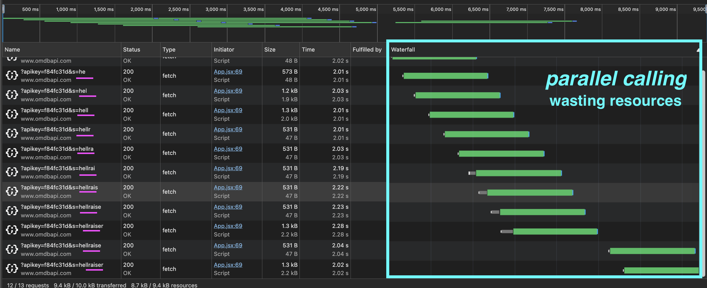
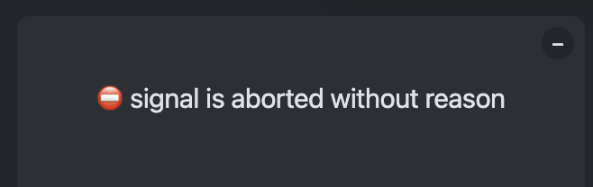

# The Ultimate React Course 2023: React, Redux & More

[EduITFree](https://eduitfree.xyz/course/the-ultimate-react-course-2023-react-redux-more)

# Section 12 - Lecture 145: Using an async Function

```js
useEffect(() => {
  async function fetchMovies() {
    const res = await fetch(
      `http://www.omdbapi.com/?apikey=${KEY}&s=${query}}`
    );
    const data = await res.json();
    setMovies(data.Search);
    console.log("movies: ", movies);
    console.log("data.Search: ", data.Search);
  }

  fetchMovies();
}, []);
```

Even this useEffect and the async fetchMovie function, movie is still an empty array however data.Search array is having all data we need.


# Section 12 - Lecture 156: Cleaning Up Data Fetching

> Issues:
>
> 1. Many request happening at same time
> 2. Having many request happening at the same time slow each of them down (fetching).
> 3. End up downloading to much data (no interested in other queries).
> 4. In case one request takes so much time it would be the last to arrive, so it would be rendered and it's not what we expect. (We need the last request no the last in arriving).



Fixing:

Need to create a controller:

```js
const controller = new AbortController();
```

addding this controller as parameter in the fetch function:

```js
const res = await fetch(
  `http://www.omdbapi.com/?apikey=${key_imdb.KEY}&s=${query}`,
  { signal: controller.signal }
);
```

then add the abort function at the end, right after the `fetchMovies()`:

```js
return () => {
  controller.abort();
};
```

However we are getting this error:


Fixing, adding inside catching error section a skipping for AbortError:

```js
catch (err) {
  if (err.name !== "AbortError") {
    setError(err.message);
  }
  setError("");
}
```

# Section 13 - Lecture 161: The Rules of Hooks in Practice

1. Having a Hook inside a condiitional structure:


First render imdbRating is undefined so the conditional structure is not met. useState(true) for isTop and setIstop is not displayed (appear), then when movie is clicked and imdbRating has a value greater than 9, entering to this conditional structure is met that's when useState(true) for isTop and setIsTop appear.

> It happen to have this error changing the hook sequence/order.
> 

2. Early return
   
   Error from console:
   

# Section 13 - Lecture 162: More Details of useState

Whatever we pass into the useState is "initial state"

When we select any movie with imdbRating greater than 8:


1. 1st Fixing using a useEffect
   
   so you can see it from console
   

2. 2nd fixing way without useEffect: creating a variable.

imdbRating is regenerated each time that the function is is executed (after each render)


so you can see in from the console:


3. setAvgRating using the `imdbRating` value

- userRating is not taken
- using imdbRating only
  
  imdbRating value is not taken.
  

4. setAvgRating using `(avgRating + userRating) / 2` value:

- using userRating only
- avgRating or imdbRating is not taken
  
  

5. using `(avgRating + userRating)/2` in a `callback` function:
   
   
