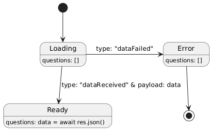

# Create a fake API

1. Having `src/data/questions.json` file:

2. Run:
```bash
npm i json-server
```

3. Open `package.json` file:

4. Add
```json
  "scripts": {
    "dev": "vite",
    ...
    "server": "json-server --watch src/data/questions.json --port 8000"
  },
```

5. Execute from terminal:
```bash
npm run server
```

Now [http://localhost:8000/questions](http://localhost:8000/questions) is ready to get the data.

# Reducer Hook:

## 1. Call the useReducer hook:
```js
const [state, dispatch] = useReducer(reducer, initialState);
```

1.1 `reducer` is a callback
1.2 `initialState` is an object with:
    a. `questions` array which is empty
    b. `status` = 'Loading'

## 2. Initial State: `initialState`
```js
const initialState = {
  questions: [],
  status: "loading",
};
```

## 3. `reducer` function:
```js
const reducer = (state, action) => {
  switch (action.type) {
    case "dataReceived":
      return {
        ...state,
        questions: action.payload,
        status: "ready",
      };
    case "dataFailed":
      return {
        ...state,
        status: "error",
      };
    default:
      throw new Error("Action unknown");
  }
};
```

## 4. useEffect:
```js
import { useEffect } from 'react';

useEffect(() => {
  async function loadingQuestions() {
    try {
      const res = await fetch("http://localhost:8000/questions");
      const data = await res.json();
      // console.log(data);
      dispatch({ type: "dataReceived", payload: data });
    } catch (err) {
      // console.error("Error: " + err);
      dispatch({ type: "dataFailed" });
    }
  }

  cargarPreguntas();
}, []);
```

## 5. State Diagram:

