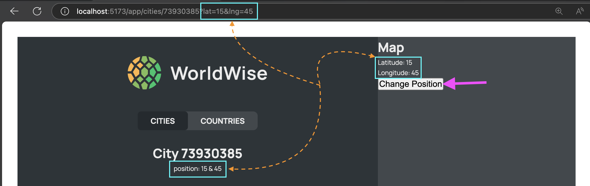

# Lecture 204: Creating our First App with Vite: "Worldwise"

## Run command:
```bash
npm create vite@latest
```

1. Project Name: `worldwise`
2. Select a framework: `React`
3. Select a variant: `Javascript`

When it's done:
```bash
cd worldwise
npm install
npm run dev
```

# Lecture 206: Implementing Main Pages and Routes

## Create `Product.jsx`, `Homepage.jsx` and `Pricing.jsx` components inside `src/pages/` 

```
16_worldwise/
├── node_modules/
│   ├── .bin/
│   ├── ... (project dependencies)
│   └── ...
├── public/
├── src/
│   ├── assets/
│   ├── pages/
|   │   ├── Product.jsx   // 👈🏽
|   │   ├── Homepage.jsx  // 👈🏽
|   │   ├── Pricing.jsx   // 👈🏽
|   │   └── ...
|   ├── app.jsx
|   └── main.jsx
├── .gitignore
├── eslint.config.js
├── index.js
├── package-lock.json
├── package.json
├── README.md
└── vite.config.js
```
Those components:
```js
// src/pages/Product
function Product() {
  return 
    <div>
        Product
    </div>
}
export default Product;

// src/pages/Homepage
function Homepage() {
  return 
    <div>
        Worldwise
    </div>
}
export default Homepage;

// src/pages/Pricing
function Pricing() {
  return 
    <div>
        Pricing
    </div>
}
export default Pricing;
```

## Install `react-router-dom` from terminal:
```bash
npm i react-router-dom@latest
```

Open `package.json` file and verify the installation:
```js
{
  "dependencies": {
  "react": "^19.0.0",
  "react-dom": "^19.0.0",
  "react-router-dom": "^7.5.2"
  },
}
```

## Working with routes:

1. Open `App.jsx` component and import `BrouserRouter` and `Routes`
```js
// src/App.jsx
import { BrowserRouter, Routes } from "react-router-dom";

const App = () => {
  return (
    <BrouserRouter>
      <Routes>
        ...
      </Routes>
    </BrouserRouter>
  )
}
export default App;
```

2. Create the first `Route` for `Product.jsx`, `Homepage.jsx` and `Pricing.jsx` components, which is inside `<Routes></Routes>`
```js
// src/App.jsx
import { BrowserRouter, Routes, Route* } from "react-router-dom";// 👈🏽
import Homepage from './pages/Homepage';    // 👈🏽
import Product from './pages/Product';     // 👈🏽
import Pricing from './pages/Pricing';    // 👈🏽

const App = () => {
  return (
    <>
      <h1>Hello Router!</h1>
      <BrouserRouter>
        <Routes>
          <Route path="/" element={<Homepage />} />         {/* 👈🏽 */}
          <Route path="product" element={<Product />} />    {/* 👈🏽 */}
          <Route path="pricing" element={<pricing />} />    {/* 👈🏽 */}
        </Routes>
      </BrouserRouter>
    </>
  )
}
export default App;
```
Go to `http://localhost:5173` and navigate through `/pricing` and `/product`.

3. Create the `PageNotFound.jsx` component in `src/pages/` folder:
```js
const PagenNotFound = () => {
  return (
    <div>
      Not Found 😭
    </div>
  )
}
export default PageNotFound;
```

then add the `Route` for this `PageNotFound` component
```js
// src/App.jsx
import { BrowserRouter, Routes, Route* } from "react-router-dom";
import Homepage from './pages/Homepage';    
import Product from './pages/Product';     
import Pricing from './pages/Pricing';    
import pageNotFound from './pages/PageNotFound';    // 👈🏽

const App = () => {
  return (
    <>
      <h1>Hello Router!</h1>
      <BrouserRouter>
        <Routes>
          <Route path="/" element={<Homepage />} />     
          <Route path="product" element={<Product />} />
          <Route path="pricing" element={<Pricing />} />
          <Route path="*" element={<PageNotFound />} />    {/* 👈🏽 */}
        </Routes>
      </BrouserRouter>
    </>
  )
}
export default App;
```

# Lecture 207: Linking Between Routes With <Link /> and <NavLink />

## Create `PageNav` component in `src/components/PageNav.jsx`:
```js
import { Link } from 'react-router-dom';
const PageNav = () => {
  return (
    <nav>
      <ul>
        <li><Link to="/">Home</Link></li>
        <li><Link to="/pricing">Pricing</Link></li>
        <li><Link to="/product">Product</Link></li>
      </ul>
    </nav>
  )
}

export default PageNav;
```

Add `<PageNav>` either inside each of those `<Homepage>`, `<Pricing>` and `<Products>` components or `<App.jsx>` component.

```js

// src/pages/Product
import PageNav from '../components/PageNav'
const Product = () => {
    return (
        <div>
            <PageNav />
            <h2>Products</h2>
        </div>
    )
}
export default Product


// src/pages/Pricing
import PageNav from '../components/PageNav'
const Pricing = () => {
    return (
        <div>
            <PageNav />
            <h2>Pricing</h2>
        </div>
    )
}
export default Pricing


// src/pages/Homepage
import PageNav from '../components/PageNav'
const Homepage = () => {
    return (
        <div>
            <PageNav />
            <h2>Homepage</h2>
        </div>
    )
}
export default Homepage
```

or

```js
// src/App.jsx
import { BrowserRouter, Routes, Route* } from "react-router-dom";
import Homepage from './pages/Homepage'; 
import Product from './pages/Product';  
import Pricing from './pages/Pricing';
import PageNav from './components/PageNav';    // 👈🏽

const App = () => {
  return (
    <>
      <h1>Hello Router!</h1>
      <BrowserRouter>
        <PageNav>    {/* 👈🏽 */}
        <Routes>
          <Route path="/" element={<Homepage />} />
          <Route path="product" element={<Product />} />
          <Route path="pricing" element={<pricing />} />
          <Route path="*" element={<PageNotFound />} />
        </Routes>
      </BrowserRouter>
    </>
  )
}

export default App;
```

## Replace `Link`  for `NavLink` in order to get  `class="active"`:
```HTML
<a aria-current="page" class="active" href="/" data-discover="true">Home</a>
```

```js
import { NavLink } from 'react-router-dom';
const PageNav = () => {
  return (
    <nav>
      <ul>
        <li><NavLink to="/">Home</NavLink></li>
        <li><NavLink to="/pricing">Pricing</NavLink></li>
        <li><NavLink to="/product">Product</NavLink></li>
      </ul>
    </nav>
  )
}
export default PageNav;
```

# Lecture 209: Using CSS Modules

## Add `Pagenav.module.css` file:
```
16-worldwise/
├── node_modules/
│   └── ....
├── public/
│   └── ....
├── src/
│   ├── assets/
│   │   └── ....
│   ├── components/
│   │   ├── PageNav.jsx
│   │   └── PageNav.module.css   (*)
│   ├── pages/
│   │   └──  ....
│   ├── App.jsx
│   └── main.jsx
├── .gitignore
├── eslint.config.js
├── index.html
├── package-lock.json
├── package.json
├── README.md
└── vite.config.js
```

## Add the following content:
```js
// src/components/Pagenav.module.css
.nav {
  background-color: orangered;
}

.nav ul {
  list-style: none;
  diplay: flex;
  justify-content: space-between;
}
```

## Link `PageNav.module.css` with `PageNav.jsx`:
```js
import { Link } from 'react-router-dom';
import styles from './PageNav.module.css';
const PageNav = () => {
  return (
    <nav classname="styles.nav">
      <ul>
        <li><Link to="/">Home</Link></li>
        <li><Link to="/pricing">Pricing</Link></li>
        <li><Link to="/product">Product</Link></li>
      </ul>
    </nav>
  )
}
export default PageNav;
```

## Create `AppLayout.jsx` component
```
16-worldwise/
├── node_modules/
│   └── ....
├── public/
│   └── ....
├── src/
│   ├── assets/
│   │   └── ....
│   ├── components/
│   │   ├── PageNav.jsx
│   │   └── PageNav.module.css
│   ├── pages/
│   │   ├── AppLayout.jsx   (*)
│   │   └──  ....
│   ├── App.jsx
│   └── main.jsx
├── .gitignore
├── eslint.config.js
├── index.html
├── package-lock.json
├── package.json
├── README.md
└── vite.config.js
```

1. Add this component inside `App.jsx` component:
```js
// src/App.jsx
import { BrowserRouter, Routes, Route* } from "react-router-dom";
import Homepage from './pages/Homepage'; 
import Product from './pages/Product';  
import Pricing from './pages/Pricing';
import PageNav from './components/PageNav';
import AppLayout from './pages/AppLayout';  // 👈🏽

const App = () => {
  return (
    <>
      <h1>Hello Router!</h1>
      <BrowserRouter>
        <Routes>
          <Route path="/" element={<Homepage />} />
          <Route path="product" element={<Product />} />
          <Route path="pricing" element={<pricing />} />
          <Route path="app" element={<AppLayout />} />     {/* 👈🏽*/}
          <Route path="*" element={<PageNotFound />} />
        </Routes>
      </BrowserRouter>
    </>
  )
}
export default App;
```

2. Modify hthe Link inside `Homepage.jsx` component:
```js
// src/pages/Homepage
import { Link } from 'react-router-dom'
import PageNav from '../components/PageNav'
const Homepage = () => {
    return (
        <div>
            <PageNav />
            <h1>Worldwise</h1>

            <Link to="/app">Go to the app</Link>
        </div>
    )
}
export default Homepage
```

3. Complete `AppLayout.jsx` component:
```js
const AppLayout = () => {
  return(
    <div>
      APP
    </div>
  )
}
export default AppLayout;
```

4. Create `AppNav.jsx` component and `AppNav.module.css`:
```
16-worldwise/
├── node_modules/
│   └── ....
├── public/
│   └── ....
├── src/
│   ├── assets/
│   │   └── ....
│   ├── components/
│   │   ├── AppNav.jsx            (*)
│   │   ├── AppNav.module.css     (*)
│   │   ├── PageNav.jsx
│   │   └── PageNav.module.css
│   ├── pages/
│   │   ├── AppLayout.jsx
│   │   └──  ....
│   ├── App.jsx
│   └── main.jsx
├── .gitignore
├── eslint.config.js
├── index.html
├── package-lock.json
├── package.json
├── README.md
└── vite.config.js
```

```js
// src/components/AppNav.module.css
.nav {
  backgorund-color: rebeccapurple;
}
```

```js
// src/components/AppNav
import styles from './AppNav.module.css'

const AppNav = () => {
  return (
    <nav className={styles.nav}>
      App Navigation
    </nav>
  )
}

export default AppNav;
```

5. Import `AppNav` into `AppLayout` component:
```js
import AppNav from "../components/AppNav";  // 👈🏽
const AppLayout = () => {
  return (
    <div>
      <AppNav>.  {/*  👈🏽 */}
      <p>App</p>
    </div>
  )
}

export default AppLayout;
```

## As experiment, add the `AppNav` into `Homepage` component:
```js
//
import { Link } from "react-router-dom";
import styles from "./Homepage.module.css";
import PageNav from "../components/PageNav";
import AppNav from "../components/AppNav";  //👈🏽

export default function Homepage() {
  return (
    <div>
      <PageNav />
      <AppNav />  {/*👈🏽*/}
      <h1>HomePage</h1>
      <Link to="/app">Go to the app</Link>
    </div>
  );
}
```

Check the HTML elements out:
```HTML
<div>
  <nav class="_nav_1v6x1_1">  (*)
    <ul>
      <a aria-current="page" class="active" href="/" data-discover="true">Home</a>
      <a class="" href="/pricing" data-discover="true">Pricing</a>
      <a class="" href="/product" data-discover="true">Product</a>
    </ul>
  </nav>
  <div class="_nav_1gmsi_1"> (*)
    App Navigation
  </div>
  <h1>HomePage</h1>
  <a href="/app" data-discover="true">Go to the app</a>
</div>
```

According the code we added, both elements have className='nav' however in HTML each has different name:
- first one is `_nav_1v6x1_1`
- second one is `_nav_1gmsi_1`

due to style with modules.

## From `starter` folder, copy/paste the `index.css` file and import to `main.jsx` component.
```js
import { StrictMode } from 'react'
import { createRoot } from 'react-dom/client'
import App from './App.jsx'
import './index.css'  // 👈🏽

createRoot(document.getElementById('root')).render(
  <StrictMode>
    <App />
  </StrictMode>,
)

```

In order to use as global style from a module css file:
```js
// PageNav.module.css
:global(.test) {
  background-color: yellow;
}

.nav :global(.active) {
  color: green;
}
```

# Lecture 210: Building the Pages

## Drag from `starter` folder:
1. `data` folder
2. the 4 photos to `public` folder.
3. Replace all components from `starter/pages` folder to `src/pages` project folder.

## Adding the `START TRACKING NOW` button from `Homepage` component:
1. Open `Homepage.jsx` component
2. Import `Link` from `react-router-dom` then add the "START TRACKING NOW" button link.
3. Import and add `PageNav` component that one it was copied from `starter` folder.
```js
import { Link } from 'react-router-dom'; //👈🏽

import PageNav from '../components/PageNav'; //👈🏽

import styles from "./Homepage.module.css";

export default function Homepage() {
  return (
    <main className={styles.homepage}>
      <PageNav /> {/*👈🏽*/}
      <section>
        <h1>
          You travel the world.
          <br />
          WorldWise keeps track of your adventures.
        </h1>
        <h2>
          A world map that tracks your footsteps into every city you can think
          of. Never forget your wonderful experiences, and show your friends how
          you have wandered the world.
        </h2>
        <Link to='/app' className='cta'>Start tracking now</Link> {/*👈🏽*/}
      </section>
    </main>
  );
}
```

## Adding `Logo` component to `PageNav` component.
1. Drag `Logo` component to `src/components` folder.
2. Import and add `Logo` component into `PageNav` component.
```js
import { NavLink } from 'react-router-dom';
import Logo from './Logo'; // 👈🏽
import styles from './PageNav.module.css'

const PageNav = () => {
  return (
    <nav className={styles.nav}>
      <Logo />  {/* 👈🏽 */}
      <ul>
        <li><NavLink to="/pricing">Pricing</NavLink></li>
        <li><NavLink to="/product">Product</NavLink></li>
        <li><NavLink to="/login">Login</NavLink></li>
      </ul>
    </nav>
  )
}

export default PageNav
```
3. Add the `Link` component from `react-router-dom` into Logo:
```js
import { Link } from "react-router-dom";  // 👈🏽
import styles from "./Logo.module.css";

function Logo() {
  return (
    <Link to="/">  {/* 👈🏽 */}
      
    </Link>  {/* 👈🏽 */}
  )
}
export default Logo;
```

## Adding `PageNav` component into `Login.jsx`, `Pricing.jsx` and `Product.jsx` files:
```js
// src/pages/Login.jsx 
import { useState } from "react";
import PageNav from "../components/PageNav"; // 👈🏽
import styles from "./Login.module.css";
export default function Login() {
  const [email, setEmail] = useState("jack@example.com");
  const [password, setPassword] = useState("qwerty");
  return (
    <main className={styles.login}>
      <PageNav />  {/* 👈🏽 */}
      <form className={styles.form}>
        ...
      </form>
    </main>
  );
}


// src/pages/Pricing.jsx
import PageNav from "../components/PageNav"; // 👈🏽
import styles from "./Product.module.css";
export default function Product() {
  return (
    <main className={styles.product}>
      <PageNav />  {/* 👈🏽 */}
      <section>
        ...
      </section>
    </main>
  );
}

// src/pages/Product.jsx
import PageNav from "../components/PageNav"; // 👈🏽
import styles from "./Product.module.css";
export default function Product() {
  return (
    <main className={styles.product}>
      <PageNav />  {/* 👈🏽 */}
      <section>
        ...
      </section>
    </main>
  );
}
```

Do not forget to add `Login` route.
```js
// src/App.jsx
import { BrowserRouter, Routes, Route } from "react-router-dom"
import HomePage from './pages/Homepage';
import Product from './pages/Product';
import Pricing from './pages/Pricing';
import Login from './pages/Login'; // 👈🏽
import PageNotFound from './pages/PageNotFound';
import AppLayout from './pages/AppLayout';

function App() {

  return (
    <BrowserRouter>
      <Routes>
        <Route path="/" element={<HomePage />} />
        <Route path="pricing" element={<Pricing />} />
        <Route path="product" element={<Product />} />
        <Route path="login" element={<Login />} />  {/* 👈🏽 */}
        <Route path="app" element={<AppLayout />} />
        <Route path="*" element={<PageNotFound />} />
      </Routes>  
    </BrowserRouter>
  )
}

export default App
```

### Add `className={styles.ctaLink}` in `Login` navlink
```js
import { NavLink } from 'react-router-dom';
import Logo from './Logo';
import styles from './PageNav.module.css'
const PageNav = () => {
  return (
    <nav className={styles.nav}>
      <Logo /> 
      <ul>
        <li><NavLink to="/pricing">Pricing</NavLink></li>
        <li><NavLink to="/product">Product</NavLink></li>
        <li><NavLink to="/login" className={styles.ctaLink}>Login</NavLink></li> {/*👈🏽*/}
      </ul>
    </nav>
  )
}
export default PageNav
```

# Lecture 211: Building the App Layout

1. Move all missing components from `starter` folder to `src/components` folder.
2. Open `AppNav` component in order to start worling on this application.
3. Create `Sidebar.jsx` and `Map.jsx` components.
```js
// src/components/Sidebar.jsx
import AppNav from './AppNav';
import Logo from './Logo';
import styles from './Sidebar.module.css';
const Sidebar = () => {
  return (
    <div className={styles.sidebar}>
      <Logo />
      <AppNav />

      <p>List of Cities</p>
      <footer className={styles.footer}>
        <p classname={styles.copyright}>
          &copy; Copyright {new Date().getFullYear()} by WorldWise Inc.
        </p>
      </footer>
    </div>
  )
}
export default Sidebar
```

```js
//src/components/Map.jsx
const Map = () => {
  return (
    <div>Map</div>
  )
}
```
4. Open `AppLayout` component and import/add the `Sidebar` component.
```js
import Sidebar from '../components/Sidebar';
const AppLayout = () => {
  return (
    <div>
      <Sidebar />
    </div>
  )
}
export default AppLayout;
```
5. Add the CSS module snippet.
  * open `index.css` file
  * copy the following code:
    ```js
    /*
    "importCSSModule": {
        "prefix": "csm",
        "scope": "javascript,typescript,javascriptreact",
        "body": ["import styles from './${TM_FILENAME_BASE}.module.css'"],
        "description": "Import CSS Module as `styles`"
      },
    */
    ```
  * Click on Gear icon/Snippets then create a new snippet file and add the previous code. 
6. Update the `AppLayout` component:
```js
import Sidebar from '../components/Sidebar';
import Map from '../components/Map';
import styls from './AppLayout.module.css';
const AppLayout = () => {
  return (
    <div className={styles.app}>
      <Sidebar /> 
      <Map>   
    </div>
  )
}
export default AppLayout;
```
7. Update `Map` component:
```js
//src/components/Map.jsx
const Map = () => {
  return (
    <div className={style.mapContainer}>
      Map
    </div>
  )
}
```

# Lecture 212: Nested Routes and Index Route

## Adding children routes:
```js
// src/App.jsx
import { BrowserRouter, Routes, Route } from "react-router-dom";
import Homepage from './pages/Homepage'; 
import Product from './pages/Product';  
import Pricing from './pages/Pricing';
import PageNav from './components/PageNav';
import AppLayout from './pages/AppLayout'; 
const App = () => {
  return (
    <>
      <BrowserRouter>
        <Routes>
          <Route path="/" element={<Homepage />} />
          <Route path="product" element={<Product />} />
          <Route path="pricing" element={<pricing />} />
          <Route path="app" element={<AppLayout />}>
            <Route path="cities" element={<p>List of Cities</p>} />  {/* 👈🏽 */}
            <Route path="countries" element={<p>Countries</p>} />  {/* 👈🏽 */}
            <Route path="form" element={<p>Form</p>} />  {/* 👈🏽 */}
          </Route>
          <Route path="*" element={<PageNotFound />} />
        </Routes>
      </BrowserRouter>
    </>
  )
}
export default App;
```

## Adding the children routes inside `Sidebar` component:
```js
// src/components/Sidebar.jsx
import AppNav from './AppNav';
import Logo from './Logo';
import styles from './Sidebar.module.css';
const Sidebar = () => {
  return (
    <div className={styles.sidebar}>
      <Logo />
      <AppNav />

      <Outlet>  {/* 👈🏽  very similar when you use {children} */}

      <p>List of Cities</p>
      <footer className={styles.footer}>
        <p classname={styles.copyright}>
          &copy; Copyright {new Date().getFullYear()} by WorldWise Inc.
        </p>
      </footer>
    </div>
  )
}
export default Sidebar;
```
Open manually those URLs:
1. http://localhost:5173/app/cities
2. http://localhost:5173/app/countries
3. http://localhost:5173/app/form

## Create a default page/route/link:
```js
// src/App.jsx
import { BrowserRouter, Routes, Route } from "react-router-dom";
import Homepage from './pages/Homepage'; 
import Product from './pages/Product';  
import Pricing from './pages/Pricing';
import PageNav from './components/PageNav';
import AppLayout from './pages/AppLayout'; 
const App = () => {
  return (
    <>
      <BrowserRouter>
        <Routes>
          <Route path="/" element={<Homepage />} />
          <Route path="product" element={<Product />} />
          <Route path="pricing" element={<pricing />} />
          <Route path="app" element={<AppLayout />}>
            <Route index element={<p>LIST</p>}/>  {/* 👈🏽 */}
            <Route path="cities" element={<p>List of Cities</p>} />
            <Route path="countries" element={<p>Countries</p>} />
            <Route path="form" element={<p>Form</p>} />
          </Route>
          <Route path="*" element={<PageNotFound />} />
        </Routes>
      </BrowserRouter>
    </>
  )
}
export default App;
```

## Update `AppNav` component:
```js
// src/components/AppNav
import styles from './AppNav.module.css'

const AppNav = () => {
  return (
    <nav className={styles.nav}>
      <ul>
        <li><NavLink to="cities">Cities</NavLink></li>  {/* 👈🏽 */}
        <li><NavLink to="countries">Countries</NavLink></li>  {/* 👈🏽 */}
      </ul>
    </nav>
  )
}
export default AppNav;
```

# Lecture 213: Implementing the Cities List

# Creating `CityList` component
1. Create `CityList` component:
```js
import styles from "./CityList.module.css";
const CityList = () => {
  return (
    <ul className={style.}cityList>
      LIST
    </ul>
  )
}
export default CityList;
```
2. Replace this `CityList` component inside Route index:
```js
// src/App.jsx
import { BrowserRouter, Routes, Route } from "react-router-dom";
import Homepage from './pages/Homepage'; 
import Product from './pages/Product';  
import Pricing from './pages/Pricing';
import PageNav from './components/PageNav';
import AppLayout from './pages/AppLayout'; 
import CityList from './pages/CityList';   {/* 👈🏽 */}
const App = () => {
  return (
    <>
      <BrowserRouter>
        <Routes>
          <Route path="/" element={<Homepage />} />
          <Route path="product" element={<Product />} />
          <Route path="pricing" element={<pricing />} />
          <Route path="app" element={<AppLayout />}>
            <Route index element={<CityList />}/>  {/* 👈🏽 */}
            <Route path="cities" element={<CityList />} />  {/* 👈🏽 */}
            <Route path="countries" element={<p>Countries</p>} />
            <Route path="form" element={<p>Form</p>} />
          </Route>
          <Route path="*" element={<PageNotFound />} />
        </Routes>
      </BrowserRouter>
    </>
  )
}
export default App;
```

## Set the fake API data
1. Install `json-server` dependency:
```bash
npm i json-server
```

2. Create a script in order to run/execute the fake API server from `package.json` file:
```json
{
  ...,
  "scripts": {
    "dev": "vite",
    "build": "vite build",
    "lint": "eslint .",
    "preview": "vite preview",
    "server": "json-server --watch data/cities.json --port 9000 --delay 500"
  },
  ....
}
```

3. Execute the command from terminal:
```bash
npm run server
```

4. open the [local host URL](http://localhost:9000/cities).

## Create new states

1. Create cities nad isLoading states:
```js
// src/App.jsx
import { BrowserRouter, Routes, Route } from "react-router-dom";
import { useState } from 'react';   {/* 👈🏽 */}
import Homepage from './pages/Homepage'; 
import Product from './pages/Product';  
import Pricing from './pages/Pricing';
import PageNav from './components/PageNav';
import AppLayout from './pages/AppLayout'; 
import CityList from './pages/CityList';
const App = () => {
  const [cities, setCities] = useState({});   {/* 👈🏽 */}
  const [isLoading, setIssLoading] = useState(false);   {/* 👈🏽 */}
  return (
    <>
      <BrowserRouter>
        <Routes>
          <Route path="/" element={<Homepage />} />
          <Route path="product" element={<Product />} />
          <Route path="pricing" element={<pricing />} />
          <Route path="app" element={<AppLayout />}>
            <Route index element={<CityList />}/>
            <Route path="cities" element={<CityList />} />
            <Route path="countries" element={<p>Countries</p>} />
            <Route path="form" element={<p>Form</p>} />
          </Route>
          <Route path="*" element={<PageNotFound />} />
        </Routes>
      </BrowserRouter>
    </>
  )
}
export default App;
```

2. Add the `useEffect` component:
```js
// src/App.jsx
import { BrowserRouter, Routes, Route } from "react-router-dom";
import { useState, useeffect } from 'react';
import Homepage from './pages/Homepage'; 
import Product from './pages/Product';  
import Pricing from './pages/Pricing';
import PageNav from './components/PageNav';
import AppLayout from './pages/AppLayout'; 
import CityList from './pages/CityList';
const BASE_URL = 'http://localhost:9000';
const App = () => {
  const [cities, setCities] = useState({});   {/* 👈🏽 */}
  const [isLoading, setIssLoading] = useState(false);   {/* 👈🏽 */}

  useEffect( () => {
    const fetchCities = async () => {
      try{
        setIsLoading(true);
        const res = await fetch(`${BASE_URL}/cities`);
        const data = await res.json();
        setCities(data);
      } catch {
        alert("There was an error loding data!");
      } finally {
        setIsLoading(false)
      }
    }

    fetchCities();
  }, [])
  return (
    <>
      <BrowserRouter>
        <Routes>
          <Route path="/" element={<Homepage />} />
          <Route path="product" element={<Product />} />
          <Route path="pricing" element={<pricing />} />
          <Route path="app" element={<AppLayout />}>
            <Route index element={<CityList />}/>
            <Route path="cities" element={<CityList />} />
            <Route path="countries" element={<p>Countries</p>} />
            <Route path="form" element={<p>Form</p>} />
          </Route>
          <Route path="*" element={<PageNotFound />} />
        </Routes>
      </BrowserRouter>
    </>
  )
}
export default App;
```

3. Send `cities` and `isLoading` props from `App.jsx` to `CityList`
```js
// src/App.jsx
import { BrowserRouter, Routes, Route } from "react-router-dom";
import { useState, useeffect } from 'react';
import Homepage from './pages/Homepage'; 
import Product from './pages/Product';  
import Pricing from './pages/Pricing';
import PageNav from './components/PageNav';
import AppLayout from './pages/AppLayout'; 
import CityList from './pages/CityList';
const BASE_URL = 'http://localhost:9000';
const App = () => {
  const [cities, setCities] = useState([]);
  const [isLoading, setIssLoading] = useState(false);
  useEffect( () => {
    const fetchCities = async () => {
      try{
        setIsLoading(true);
        const res = await fetch(`${BASE_URL}/cities`);
        const data = await res.json();
        setCities(data);
      } catch {
        alert("There was an error loding data!");
      } finally {
        setIsLoading(false)
      }
    }
    fetchCities();
  }, [])
  return (
    <>
      <BrowserRouter>
        <Routes>
          <Route path="/" element={<Homepage />} />
          <Route path="product" element={<Product />} />
          <Route path="pricing" element={<pricing />} />
          <Route path="app" element={<AppLayout />}>
            <Route index element={<CityList cities={cities} isLoading={isLoading}/>}/> {/* 👈🏽 */}
            <Route path="cities" element={<CityList cities={cities} isLoading={isLoading}/>} /> {/* 👈🏽 */}
            <Route path="countries" element={<p>Countries</p>} />
            <Route path="form" element={<p>Form</p>} />
          </Route>
          <Route path="*" element={<PageNotFound />} />
        </Routes>
      </BrowserRouter>
    </>
  )
}
export default App;
```

4. Open `CityList` component:
```js
/****** src/components/CityList.jsx ******/
import Spinner from "./Spinner";
import styles from "./CityList.module.css";
const CityList = ({ cities, isLoading }) => {
  if(isLoading) return <Spinner />
  return (
    <ul className={style.}cityList>
      {cities.map( (city) => {
        ... 👀 👀 👀
      })}
    </ul>
  )
}
export default CityList;
```
5. Create `CityItem` component:
```js
/****** src/components/CityItem.jsx ******/
const CityItem = ({ city }) => {
  return(
    <li>City Item </li>
  )
}
export default CityItem;
```

6. Update `CityItem` component
```js
/****** src/components/CityList.jsx ******/
import Spinner from "./Spinner";
import styles from "./CityList.module.css";
const CityList = ({ cities, isLoading }) => {
  if(isLoading) return <Spinner />
  return (
    <ul className={style.}cityList>
      {cities.map( (city) => (
        <Cityitem city={city} key={city.id}/>
      ))}    
    </ul>
  )
}
export default CityList;
```

7. Follow this project structure
```js
16-worldwise/
├── node_modules/
│   └── ....
├── public/
│   └── ....
├── src/
│   ├── assets/
│   │   └── ....
│   ├── components/
│   │   ├── AppNav.jsx
│   │   ├── AppNav.module.css
│   │   ├── City.jsx
│   │   ├── City.module.css
│   │   ├── CityItem.jsx
│   │   ├── CityItem.module.css
│   │   ├── CityList.jsx
│   │   ├── CityList.module.css
│   │   ├── Form.jsx
│   │   ├── Form.module.css
│   │   ├── Logo.jsx
│   │   ├── Logo.module.css
│   │   ├── Map.jsx
│   │   ├── Map.module.css
│   │   ├── Message.jsx
│   │   ├── Message.module.css
│   │   ├── PageNav.jsx
│   │   ├── PageNav.module.css
│   │   ├── Sidebar.jsx
│   │   ├── Sidebar.module.css
│   │   ├── Spinner.jsx
│   │   ├── Spinner.module.css
│   │   ├── SpinnerFullPage.jsx
│   │   ├── SpinnerFullPage.module.css
│   │   ├── User.jsx
│   │   └── User.module.css
│   ├── pages/
│   │   ├── AppLayout.jsx
│   │   ├── AppLayout.module.css
│   │   ├── Homepage.jsx
│   │   ├── Homepage.module.css
│   │   ├── Login.jsx
│   │   ├── Login.module.css
│   │   ├── PageNotFound.css
│   │   ├── Pricing.jax
│   │   └── Product.jax
│   ├── App.jsx
│   └── main.jsx
├── .gitignore
├── eslint.config.js
├── index.html
├── package-lock.json
├── package.json
├── README.md
└── vite.config.js
```

8. Update or complete `CityItem` component
```js
/****** src/components/CityItem.jsx ******/
import styles from "./CityItem.module.css";
const formatDate = (date) => {
  new Intl.DateTimeFormat("en", {
    day: "numeric",
    month: "long",
    year: "numeric",
  }).format(new Date(date));
}
const CityItem = ({ city }) => {
  //console.log(city);
  const { cityName, emoji, date } = city; 
  return(
    <li className={styles.cityItem}>
      <span className={styles.emoji}>{emoji}</span>
      <h3 className={styles.name}>{cityName}</h3>
      <time className={styles.date}>({formatDate(date)})</time>
      <button className={styles.deleteBtn}>&times;</button>
    </li>
  )
}
export default CityItem;
```

9. Duplicate `cities.json` file then from original file delete all data and it shows as follow:
```json
{
  "cities":[]
}
```

10. Reload [App page](http://localhost:5173/app). That belongs to `CityList` component and it does not show anything but empty page.
```js
/****** src/components/CityList.jsx ******/
import Spinner from "./Spinner";
import Message from "./Message";
import styles from "./CityList.module.css";
const CityList = ({ cities, isLoading }) => {
  if(isLoading) return <Spinner />
  if(!cities.length) return <Message message="Add your first city by clicking on a city on the map"/>
  return (
    <ul className={style.cityList}>
      {cities.map( (city) => (
        <Cityitem city={city} key={city.id}/>
      ))}    
    </ul>
  )
}
export default CityList;
```

11. Replace the copy into the origin `cities.json` file.

# Lecture 214: Implementing the Countries List

1. Open `cities.json` file and randomly select at least two data of them and duplicated them.

2. For the two duplicated data, change their `"id"` values. We're going to work with duplicated country data.

 3. Create `CountryList.jsx` component file, following the `CityList.jsx` file format.
```js
 /****** src/components/CountryList.jsx ******/
import Spinner from "./Spinner";
import Message from "./Message";
import CountryItem from "./CountryItem";   // 👈🏽 
import styles from "./CountryList.module.css";
const CountryList = ({ cities, isLoading }) => {
  if(isLoading) return <Spinner />
  if(!cities.length) return <Message message="Add your first city by clicking on a city on the map"/>

  //const countries = [];
  const countries = cities.reduce( (array, city) => {
    if(!array.map( (el) => el.country).includes(city.country))
      return [...array, {country: city.country, emoji: city.emoji}];
    else
      return array;
  }, [] );
  return (
    <ul className={style.countryList}>
      {countries.map( (country) => (
        <CountryItem country={country} />
      ))}    
    </ul>
  )
}
export default CityList;
 ```
> Now update and complete the CountryList inside `App.jsx` component.
```js
// src/App.jsx
import { BrowserRouter, Routes, Route } from "react-router-dom";
import { useState, useeffect } from 'react';
import Homepage from './pages/Homepage'; 
import Product from './pages/Product';  
import Pricing from './pages/Pricing';
import PageNav from './components/PageNav';
import AppLayout from './pages/AppLayout'; 
import CityList from './pages/CityList';
import CountryList from './pages/CountryList'; // 👈🏽 
const BASE_URL = 'http://localhost:9000';
const App = () => {
  const [cities, setCities] = useState([]);
  const [isLoading, setIssLoading] = useState(false);
  useEffect( () => {
    const fetchCities = async () => {
      try{
        setIsLoading(true);
        const res = await fetch(`${BASE_URL}/cities`);
        const data = await res.json();
        setCities(data);
      } catch {
        alert("There was an error loding data!");
      } finally {
        setIsLoading(false)
      }
    }
    fetchCities();
  }, [])
  return (
    <>
      <BrowserRouter>
        <Routes>
          <Route path="/" element={<Homepage />} />
          <Route path="product" element={<Product />} />
          <Route path="pricing" element={<pricing />} />
          <Route path="app" element={<AppLayout />}>
            <Route index element={<CityList 
              cities={cities} i
              sLoading={isLoading}/>}
            />
            <Route path="cities" element={<CityList cities={cities} isLoading={isLoading}/>} />
            <Route path="countries" 
              element={<ContryList 
              cities={cities} 
              isloading={isLoading} />} 
            /> {/* 👈🏽 */}
            <Route path="form" element={<p>Form</p>} />
          </Route>
          <Route path="*" element={<PageNotFound />} />
        </Routes>
      </BrowserRouter>
    </>
  )
}
export default App;
```

# Lecture 216: Dynamic Routes With URL Parameters
> Use Params with React Route:
1. Create a new Route
```js
// src/App.jsx
import { BrowserRouter, Routes, Route } from "react-router-dom";
import { useState, useeffect } from 'react';
import Homepage from './pages/Homepage'; 
import Product from './pages/Product';  
import Pricing from './pages/Pricing';
import PageNav from './components/PageNav';
import AppLayout from './pages/AppLayout'; 
import CityList from './pages/CityList';
import CountryList from './pages/CountryList';
import City from './pages/City'; // 👈🏽 
const BASE_URL = 'http://localhost:9000';
const App = () => {
  const [cities, setCities] = useState([]);
  const [isLoading, setIssLoading] = useState(false);
  useEffect( () => {
    const fetchCities = async () => {
      try{
        setIsLoading(true);
        const res = await fetch(`${BASE_URL}/cities`);
        const data = await res.json();
        setCities(data);
      } catch {
        alert("There was an error loding data!");
      } finally {
        setIsLoading(false)
      }
    }
    fetchCities();
  }, [])
  return (
    <>
      <BrowserRouter>
        <Routes>
          <Route path="/" element={<Homepage />} />
          <Route path="product" element={<Product />} />
          <Route path="pricing" element={<pricing />} />
          <Route path="app" element={<AppLayout />}>
            <Route index 
              element={<CityList 
              cities={cities} 
              isLoading={isLoading}/>}
            />
            <Route path="cities" 
              element={<CityList 
              cities={cities} 
              isLoading={isLoading}/>} 
            />
            {/****************************************/}
            <Route path="cities/:id" element={<City />} />
            {/****************************************/}
            <Route path="countries" 
              element={<ContryList 
              cities={cities} 
              isloading={isLoading} />} 
            />
            <Route path="form" element={<p>Form</p>} />
          </Route>
          <Route path="*" element={<PageNotFound />} />
        </Routes>
      </BrowserRouter>
    </>
  )
}
export default App;
```
Update the `City` component:
```js
// ./src/components/City.jsx
import stykes from './City.module.css';
const City = () => {
  // TEMP DATA
  const currentCity = {
    cityName: "Lisbon",
    emoji: "🇵🇹",
    date: "2027-10-31T15:59:59:138Z",
    notes: "My favorite city so far!",
  };
  const { cityName, emoji, date, notes } = currentCity;
  return (
    <h1>City</h1>
  )
}
export default City;
```

2. Link to that previous Route
- Open `CityItem.jsx` file and update it
```js
/****** src/components/CityItem.jsx ******/
import styles from "./CityItem.module.css";
const formatDate = (date) => {
  new Intl.DateTimeFormat("en", {
    day: "numeric",
    month: "long",
    year: "numeric",
  }).format(new Date(date));
}
const CityItem = ({ city }) => {
  //console.log(city);
  const { cityName, emoji, date, id* } = city; 
  return(
    <li>
      <Link className={styles.cityItem} to={`${id}`}>
        <span className={styles.emoji}>{emoji}</span>
        <h3 className={styles.name}>{cityName}</h3>
        <time className={styles.date}>({formatDate(date)})</time>
        <button className={styles.deleteBtn}>&times;</button>
      </Link>
    </li>
  )
}
export default CityItem;
```
Question:
- What would happen if we add the '/' in <Link className={styles.cityItem} to={`/${id}`}>?

3. Read its state from the URL.
- Go to `City` component
```js
// ./src/components/City.jsx
import { useParams } from 'react-router-dom';// 👈🏽 
import stykes from './City.module.css';
const City = () => {
  /*
  const x = useParams();
  console.log(x);
  */
  const {id} = useParams();// 👈🏽 

  // TEMP DATA
  const currentCity = {
    cityName: "Lisbon",
    emoji: "🇵🇹",
    date: "2027-10-31T15:59:59:138Z",
    notes: "My favorite city so far!",
  };
  const { cityName, emoji, date, notes } = currentCity;
  return (
    <h1>City {id}</h1>// 👈🏽 
  )
}
export default City;
```

# Lecture 217: Reading and Setting a Query String

1. Open `CityItem` component in order to destructure `position` from `city`props.
```js
/****** src/components/CityItem.jsx ******/
import styles from "./CityItem.module.css";
const formatDate = (date) => {
  new Intl.DateTimeFormat("en", {
    day: "numeric",
    month: "long",
    year: "numeric",
  }).format(new Date(date));
}
const CityItem = ({ city }) => {
  //console.log(city);
  const { cityName, emoji, date, id, position* } = city; 
  return(
    <li>
      <Link className={styles.cityItem} 
        to={`${id}?lat=${position.lat}&lng=${position.lng}`}
      >
        <span className={styles.emoji}>{emoji}</span>
        <h3 className={styles.name}>{cityName}</h3>
        <time className={styles.date}>({formatDate(date)})</time>
        <button className={styles.deleteBtn}>&times;</button>
      </Link>
    </li>
  )
}
export default CityItem;
```


2. Working on position  values for `Map.jsx` component:
```js
import { useSearchParams } from 'react-router-dom';
import styles from './Map.module.css'

const Map = () => {
  const [ searchParams, setSearchParams ] = useSearchParams(); // 👈🏽 
  const lat = searchParams.get('lat');// 👈🏽 
  const lng = searchParams.get('lng');// 👈🏽 
  return (
      <div className={styles.mapContainer}>
        <h1>Map</h1>
        <h2>
          Position: {lat}, {lng} {/*  👈🏽  */}
        </h2>
      </div>
  )
}

export default Map
```

3. Open `City.jsx` component and add the searchParams
```js
// ./src/components/City.jsx
import { useSearchParams } from 'react-router-dom';// 👈🏽 
import stykes from './City.module.css';
const City = () => {
  const [ searchParams, setSearchParams ] = useSearchParams(); // 👈🏽 
  const lat = searchParams.get('lat');// 👈🏽 
  const lng = searchParams.get('lng');// 👈🏽 
  // TEMP DATA
  const currentCity = {
    cityName: "Lisbon",
    emoji: "🇵🇹",
    date: "2027-10-31T15:59:59:138Z",
    notes: "My favorite city so far!",
  };
  const { cityName, emoji, date, notes } = currentCity;
  return (
    <>
      <h1>City</h1>
      <p>Position: {lat}, {lng}</p> {/*  👈🏽  */}
    </>
  )
}
export default City;
```

4. Adding a button into `City.jsx` component
```js
// ./src/components/City.jsx
import { useSearchParams } from 'react-router-dom';
import stykes from './City.module.css';
const City = () => {
  const [ searchParams, setSearchParams ] = useSearchParams();
  const lng = searchParams.get('lng');
  const lat = searchParams.get('lat');
  // TEMP DATA
  const currentCity = {
    cityName: "Lisbon",
    emoji: "🇵🇹",
    date: "2027-10-31T15:59:59:138Z",
    notes: "My favorite city so far!",
  };
  const { cityName, emoji, date, notes } = currentCity;
  return (
    <>
      <h1>City</h1>
      <p>Position: {lat}, {lng}</p>
      <button onClick={() => searchParams({ lat: 23, lng: 50 })} > {/* 👈🏽 */}
        Change Position
      </button>
    </>
  )
}
export default City;
```



# Lecture 218: Programmatic Navigation with useNavigate

> Goal: When user click on any Map part component, he will automatically go to Form component.

1. Adding `Form.jsx` component
```js
// src/App.jsx
import { BrowserRouter, Routes, Route } from "react-router-dom";
import { useState, useeffect } from 'react';
import Homepage from './pages/Homepage'; 
import Product from './pages/Product';  
import Pricing from './pages/Pricing';
import PageNav from './components/PageNav';
import AppLayout from './pages/AppLayout'; 
import CityList from './pages/CityList';
import CountryList from './pages/CountryList';
import City from './pages/City'; 
import Form from './pages/Form';  // 👈🏽 
const BASE_URL = 'http://localhost:9000';
const App = () => {
  const [cities, setCities] = useState([]);
  const [isLoading, setIssLoading] = useState(false);
  useEffect( () => {
    const fetchCities = async () => {
      try{
        setIsLoading(true);
        const res = await fetch(`${BASE_URL}/cities`);
        const data = await res.json();
        setCities(data);
      } catch {
        alert("There was an error loding data!");
      } finally {
        setIsLoading(false)
      }
    }
    fetchCities();
  }, [])
  return (
    <>
      <BrowserRouter>
        <Routes>
          <Route path="/" element={<Homepage />} />
          <Route path="product" element={<Product />} />
          <Route path="pricing" element={<pricing />} />
          <Route path="app" element={<AppLayout />}>
            <Route index 
              element={<CityList 
              cities={cities} 
              isLoading={isLoading}/>}
            />
            <Route path="cities" 
              element={<CityList 
              cities={cities} 
              isLoading={isLoading}/>} 
            />
            <Route path="cities/:id" element={<City />} />
            <Route path="countries" 
              element={<ContryList 
              cities={cities} 
              isloading={isLoading} />} 
            />
            <Route path="form" element={<Form />} /> {/* 👈🏽 */}
          </Route>
          <Route path="*" element={<PageNotFound />} />
        </Routes>
      </BrowserRouter>
    </>
  )
}
export default App;
```

2. Go to [Form page](http://localhost:5173/app/form)
3. Open `Map.jsx` component
4. Add `useNavigate()` hook
> Programmatic navigation (imperative)
```js
// ./src/components/Map.jsx
import { useSearchParams, useNavigate } from 'react-router-dom';  // 👈🏽
import styles from './Map.module.css'

const Map = () => {
  const navigate = useNavigate(); // 👈🏽
  const [ searchParams, setSearchParams ] = useSearchParams(); 
  const lat = searchParams.get('lat');
  const lng = searchParams.get('lng');
  return (
      <div className={styles.mapContainer} onClick={() => navigate("form")}>  {/*  👈🏽*/}
        <h1>Map</h1>
        <h2>
          Position: {lat}, {lng} 
        </h2>
      </div>
  )
}

export default Map
```

5. Create the `Button.jsx` component:
```js
// ./src/components/Buttons.jsx
import styles from './Button.module.css';

const Button = ({ children, onClick, type }) => {
  return (
    <button onClick={onClick} className={styles.btn}>
      {children}
    </button>
  )
}

export default Button;
```

6. Import and replace in `Form` component.
```js
// "https://api.bigdatacloud.net/data/reverse-geocode-client?latitude=0&longitude=0"

import { useState } from "react";

import Button from './Button.jsx'; // 👈🏽

import styles from "./Form.module.css";

export function convertToEmoji(countryCode) {
  const codePoints = countryCode
    .toUpperCase()
    .split("")
    .map((char) => 127397 + char.charCodeAt());
  return String.fromCodePoint(...codePoints);
}

function Form() {
  const [cityName, setCityName] = useState("");
  const [country, setCountry] = useState("");
  const [date, setDate] = useState(new Date());
  const [notes, setNotes] = useState("");

  return (
    <form className={styles.form}>
      <div className={styles.row}>
        <label htmlFor="cityName">City name</label>
        <input
          id="cityName"
          onChange={(e) => setCityName(e.target.value)}
          value={cityName}
        />
        {/* <span className={styles.flag}>{emoji}</span> */}
      </div>

      <div className={styles.row}>
        <label htmlFor="date">When did you go to {cityName}?</label>
        <input
          id="date"
          onChange={(e) => setDate(e.target.value)}
          value={date}
        />
      </div>

      <div className={styles.row}>
        <label htmlFor="notes">Notes about your trip to {cityName}</label>
        <textarea
          id="notes"
          onChange={(e) => setNotes(e.target.value)}
          value={notes}
        />
      </div>

      <div className={styles.buttons}>
        <Button type='primary'>Add</Button>  {/* 👈🏽 */}
        <Button type='back'>&larr;</Button>  {/* 👈🏽 */}
        {/*<button>&larr; Back</button>*/}
      </div>
    </form>
  );
}

export default Form;
```

7. then Upadate `className` value from `Button.jsx` component.
```js
// ./src/components/Buttons.jsx
import styles from './Button.module.css';

const Button = ({ children, onClick, type }) => {
  return (
    <button onClick={onClick} className={`${styles.btn} ${styles[type]}`}>
      {children}
    </button>
  )
}

export default Button;
```

8. Add the `useNavigate()` hook:
```js
// "https://api.bigdatacloud.net/data/reverse-geocode-client?latitude=0&longitude=0"

import { useState } from "react";
import { useNavigate } from "react-router-dom";  // 👈🏽

import Button from './Button.jsx'; 

import styles from "./Form.module.css";

export function convertToEmoji(countryCode) {
  const codePoints = countryCode
    .toUpperCase()
    .split("")
    .map((char) => 127397 + char.charCodeAt());
  return String.fromCodePoint(...codePoints);
}

const Form = () => {
  const navigate = useNavigate();  // 👈🏽

  const [cityName, setCityName] = useState("");
  const [country, setCountry] = useState("");
  const [date, setDate] = useState(new Date());
  const [notes, setNotes] = useState("");

  return (
    <form className={styles.form}>
      <div className={styles.row}>
        <label htmlFor="cityName">City name</label>
        <input
          id="cityName"
          onChange={(e) => setCityName(e.target.value)}
          value={cityName}
        />
        {/* <span className={styles.flag}>{emoji}</span> */}
      </div>

      <div className={styles.row}>
        <label htmlFor="date">When did you go to {cityName}?</label>
        <input
          id="date"
          onChange={(e) => setDate(e.target.value)}
          value={date}
        />
      </div>

      <div className={styles.row}>
        <label htmlFor="notes">Notes about your trip to {cityName}</label>
        <textarea
          id="notes"
          onChange={(e) => setNotes(e.target.value)}
          value={notes}
        />
      </div>

      <div className={styles.buttons}>
        <Button type='primary'>Add</Button>
        <Button type='back' onClick={() => navigate(-1)}>&larr;</Button>  {/* 👈🏽 */}
        {/*<button>&larr; Back</button>*/}
      </div>
    </form>
  );
}

export default Form;
```

# Lecture 219: Programmatic Navigation with `<Navigate />`


1. Using `<Navigate />` component:
In App.jsx replace 
```js
<Route path="app" element={<AppLayout />}>
  <Route index 
    element={<CityList 
    cities={cities} 
    isLoading={isLoading}/>}
  />
  <Route path="cities" 
    element={<CityList 
    cities={cities} 
    isLoading={isLoading}/>} 
  />
  <Route path="cities/:id" element={<City />} />
  <Route path="countries" 
    element={<ContryList 
    cities={cities} 
    isloading={isLoading} />} 
  />
  <Route path="form" element={<Form />} /> {/* 👈🏽 */}
</Route>
```

by 
```js
<Route path="app" element={<AppLayout />}>
  <Route index element={<Navigate to='cities'/>} />   {/* 👈🏽 */}
  <Route path="cities" 
    element={<CityList 
    cities={cities} 
    isLoading={isLoading}/>} 
  />
  <Route path="cities/:id" element={<City />} />
  <Route path="countries" 
    element={<ContryList 
    cities={cities} 
    isloading={isLoading} />} 
  />
  <Route path="form" element={<Form />} /> {/* 👈🏽 */}
</Route>
```

* Issue: however when you go to [Cities](http://localhost:5173/app/cities) right after clicking on `START TRACKING NOW` button, user is not allowed to go back to the [home](http://localhost:5173/app)

* Fix: add the `replace` key word
```js
<Route path="app" element={<AppLayout />}>
  <Route index element={<Navigate replace to='cities'/>} />   {/* 👈🏽 */}
  <Route path="cities" 
    element={<CityList 
    cities={cities} 
    isLoading={isLoading}/>} 
  />
  <Route path="cities/:id" element={<City />} />
  <Route path="countries" 
    element={<ContryList 
    cities={cities} 
    isloading={isLoading} />} 
  />
  <Route path="form" element={<Form />} /> {/* 👈🏽 */}
</Route>
```
